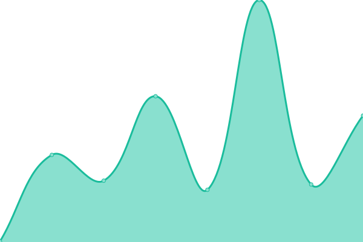

# [📈 Live Status](https://status.krown.one): <!--live status--> **🟧 Partial outage**

This repository contains the open-source uptime monitor and status page for [krown-one](https://status.kroen.one), powered by [Upptime](https://github.com/upptime/upptime).

With [Upptime](https://upptime.js.org), you can get your own unlimited and free uptime monitor and status page, powered entirely by a GitHub repository. We use [Issues](https://github.com/krown-one/status/issues) as incident reports, [Actions](https://github.com/krown-one/status/actions) as uptime monitors, and [Pages](https://status.kroen.one) for the status page.

<!--start: status pages-->
<!-- This summary is generated by Upptime (https://github.com/upptime/upptime) -->
<!-- Do not edit this manually, your changes will be overwritten -->
<!-- prettier-ignore -->
| URL | Status | History | Response Time | Uptime |
| --- | ------ | ------- | ------------- | ------ |
|  [Web](https://www.krown.one/) | 🟩 Up | [web.yml](https://github.com/krown-one/status/commits/HEAD/history/web.yml) | 

 701ms
     
 | 

<a href="https://status.krown.one/history/web">99.85%</a>
    

|  [Dev Web](https://dev.krown.one/) | 🟩 Up | [dev-web.yml](https://github.com/krown-one/status/commits/HEAD/history/dev-web.yml) | 

 368ms
     
 | 

<a href="https://status.krown.one/history/dev-web">99.41%</a>
    

|  [Lustrall](https://lustrall.krown.one/) | 🟥 Down | [lustrall.yml](https://github.com/krown-one/status/commits/HEAD/history/lustrall.yml) | 

 249ms
     
 | 

<a href="https://status.krown.one/history/lustrall">100.00%</a>
    

|  [Assets Impulso](https://branded.krown.one/impulso/) | 🟥 Down | [assets-impulso.yml](https://github.com/krown-one/status/commits/HEAD/history/assets-impulso.yml) | 

 300ms
     
 | 

<a href="https://status.krown.one/history/assets-impulso">99.57%</a>
    

<!--end: status pages-->

[**Visit our status website →**](https://status.krown.one)

## 📄 License

- Powered by: [Upptime](https://github.com/upptime/upptime)
- Code: [MIT](./LICENSE) © [krown-one](https://status.krown.one)
- Data in the `./history` directory: [Open Database License](https://opendatacommons.org/licenses/odbl/1-0/)
